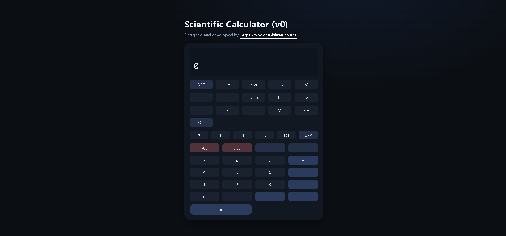

# Scientific Calculator (React + Vite)



Production-quality scientific calculator built with **React (Vite)** and **styled-components** - featuring a **DEG/RAD** trig, **scientific notation (EXP)**, implicit multiplication, and keyboard support.

###

-   **Live:** https://a2rp.github.io/scientific-calculator/
-   **Repo:** https://github.com/a2rp/scientific-calculator

## ✨ Features

-   **Safe expression engine**
    -   Precedence & associativity: `^` > unary `−` > `× ÷` > `+ −`
    -   **Unary minus**, **parentheses**, and **implicit ×**: `2(3+4)`, `π(2+3)`, `3sin(30)`
-   **Scientific functions**
    -   `sin cos tan`, `asin acos atan` (with **DEG/RAD** toggle)
    -   `ln log sqrt`, `abs floor ceil`
    -   Postfix: `!` (factorial), `%` (percent of 100)
    -   Constants: `π`, `e`
-   **Scientific notation (EXP)**
    -   `3.2e3` → 3200, `5e-2` → 0.05
    -   Display formats large/small numbers nicely (e.g., `1e+12`)
-   **Great UX**
    -   Keyboard shortcuts (numbers, ops, Enter, Backspace…)
    -   DEG/RAD persisted in `localStorage`
    -   Accessible focus & live result region
-   **Clean styling**
    -   **CSS variables + global resets in `index.css`**
    -   **`styled-components`**

---

## 🔑 Keyboard Shortcuts

-   Digits: `0–9`
-   Operators: `+ - * / ^` (`*`/`x` → ×, `/` → ÷)
-   Decimal: `.`
-   Parentheses: `(` `)`
-   Postfix: `%` and `!`
-   Constants: `p` → `π`, `e` → context-aware (exponent after a number, constant otherwise)
-   Actions: `Enter` or `=` → evaluate, `Backspace` → DEL, `Esc` → AC
-   Mode: `R` → toggle **DEG/RAD**

> **Percent behavior:** Postfix percent divides by 100 (e.g., `200×15%` → `30`).  
> **Factorial:** Non-negative integers only; 170! max before overflow.

---

## 🚀 Getting Started

```bash
# clone
git clone https://github.com/a2rp/scientific-calculator
cd scientific-calculator

# install
npm i

# dev
npm run dev

# build
npm run build

# preview production build
npm run preview
```
